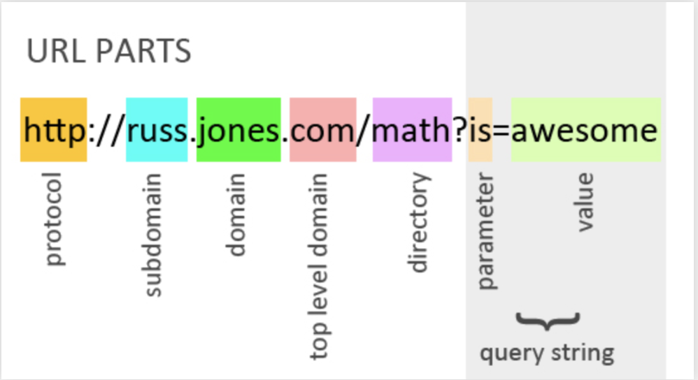

<h1> URLS & REQUESTS </h1>

<h3> URL Parts  </h3>

<h2> What is an API? </h2>

 An application program interface (API) is a set of routines, protocols, and tools for building software applications. Basically, an API specifies how software components should interact. Additionally, APIs are used when programming graphical user interface (GUI) components 

 <a href="https://www.smashingmagazine.com/2018/01/understanding-using-rest-api/"> Understanding and Using REST APIs </a> 

